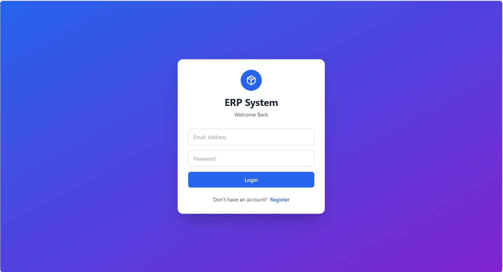
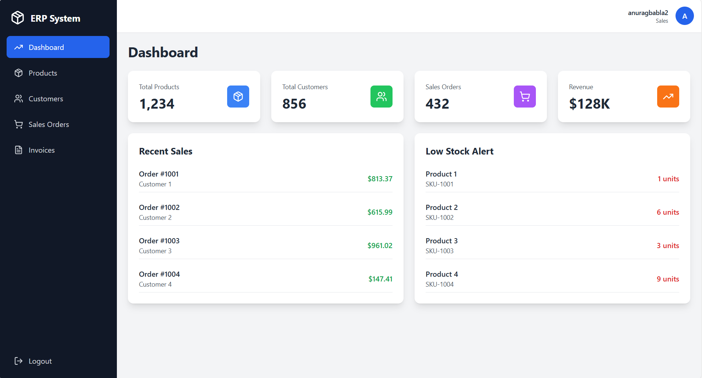
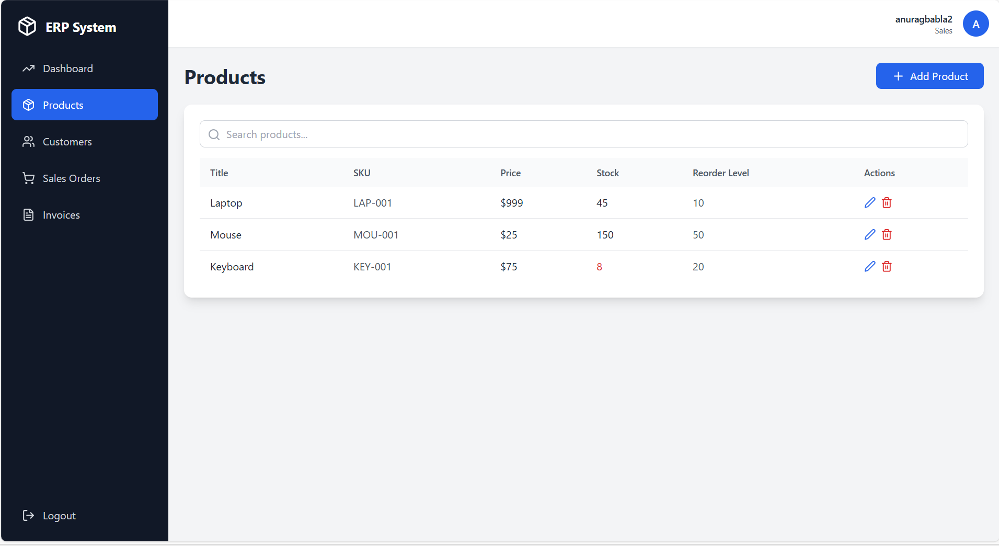

# 📦 ERP System – React + Tailwind CSS

A modern and responsive ERP (Enterprise Resource Planning) Dashboard built using **React**, **Vite**, **Tailwind CSS**, and **Lucide Icons**.
This project includes authentication, product CRUD, customer directory, sales orders, and a clean dashboard UI.

---

## 📸 Screenshots

### 🔐 Login Page



### 📊 Dashboard



### 📦 Products Module



### 🧾 Sample View (Invoices / Errors / UI)

.png)

---

## 🚀 Features

### ✔ Authentication

* Login & Register screens
* Mock token-based login
* Context API for state management

### ✔ Dashboard

* Analytics cards
* Recent sales
* Low stock alerts

### ✔ Products Module (Full CRUD)

* Add, Edit, Delete products
* Modal form interface
* Search functionality
* Reorder-level warnings
* Toast notifications

### ✔ Customers Module

* Customer table
* Ready for CRUD expansion

### ✔ Sales Orders

* Orders listing
* Status badges
* View & download buttons

### ✔ UI & Experience

* Responsive layout
* Sidebar navigation
* Mobile-friendly
* Clean Tailwind design
* Lucide icon set

---

## 🛠 Tech Stack

| Technology   | Purpose                  |
| ------------ | ------------------------ |
| React        | Component UI             |
| Vite         | Development & build tool |
| Tailwind CSS | Styling                  |
| Lucide Icons | Icon system              |
| Context API  | Authentication state     |

---

## 📂 Folder Structure

```
erp-app/
│ index.html
│ vite.config.js
│ tailwind.config.js
│ postcss.config.js
│ package.json
│
└───src/
    │ App.jsx
    │ main.jsx
    │ index.css
    │
    ├── assets/
    └── components/ (optional future structuring)
```

---

## 📥 Installation & Setup

Clone the repo:

```sh
git clone https://github.com/me-anuragg/react-erp-system.git
cd react-erp-system
```

Install dependencies:

```sh
npm install
```

Run the dev server:

```sh
npm run dev
```

Open:

```
http://localhost:5173
```

---

## 🎨 Tailwind CSS Setup

Ensure your `tailwind.config.js` contains:

```js
export default {
  content: ["./index.html", "./src/**/*.{js,jsx}"],
  theme: { extend: {} },
  plugins: [],
};
```

And your `src/index.css` contains:

```css
@tailwind base;
@tailwind components;
@tailwind utilities;
```

---

## 🔒 Authentication Note

The system currently uses a **mock login token** for demonstration.
You can easily replace this with a real backend later (Node.js, Django, Firebase, etc.)

---

## 📈 Future Improvements

* Backend API integration
* Role-based permissions
* Invoices module
* Chart visualizations
* Pagination & filters
* Better responsive sidebar

---

## 🤝 Contributing

Pull requests and suggestions are welcome.
Fork the project → create a branch → submit PR.

---

## 📄 License

MIT License – free to use & modify.

---

